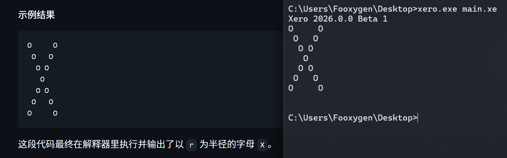
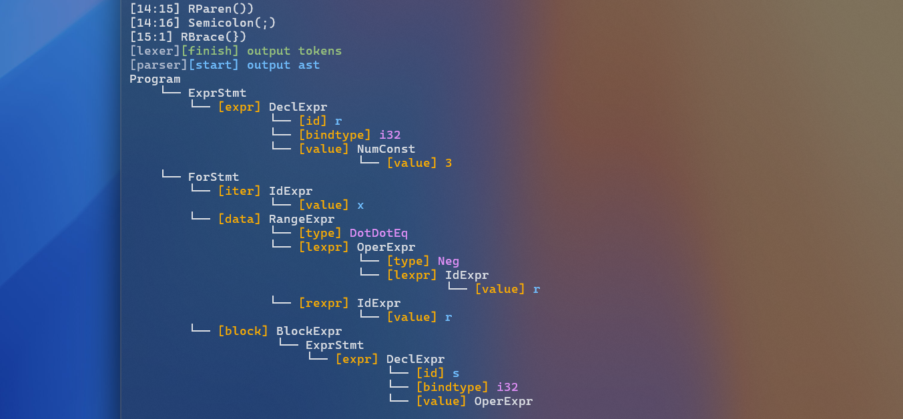

> [!NOTE]
> 存储库与 Wiki：https://github.com/Fooxygen/Xero
>
> 欢迎提交 issue 告诉我你的想法，或报告 Bug，或者 Star 支持一下~

## Xero 是什么？

这是我自己设计的一门静态类型编程语言及其解释器，诞生于 2026 年 6 月 21 日。

之所以有这个想法，是因为过去一年内我在打数据库内核竞赛，关注到词法和语法解析部分使用了 Flex 和 Bison 这两个工具，还挺易用的，在做具体功能时也对从 SQL 转换为 Ast 感兴趣。于是我想到能不能自己设计一套代码语法，最终执行出想要的程序，很快我就着手开始实现。

## 基础

不过此时我还没上过《编译原理》这门课，初步的概念就是把文本读取成 Token 流，再转换为 Ast，最终逐个节点执行返回结果。我接触到的第一个相关内容的系列视频是 [Premature Abstraction](https://www.youtube.com/@PrematureAbstraction) 的 Compilers 入门（这个频道还有很多有意思的内容，打算下半年补一补 😄）。他的视频把诸如词法语法分析的步骤都大致阐述，还包括 LL 与 LR 规约的优缺点，挺易懂的。

目前的定位是先打造一个 Ast 解释器，目标是接入 LLVM 最终实现编译出可执行文件。所以目前 Xero 实质还是 Demo，执行路线是 `Lexer -> Parser -> Runtime`。

## Lexer

首先是写出词法分析器，简单来说就是把若干长度的字符序列翻译成有意义的词语，我们叫做 Token。

| Lexeme | Type |
| - | - |
| + | Plus |
| ( | LParen |
| 3.14 | Number |
| name | Id |

Lexeme 是词素，也就是对应的原始的字符序列，它和识别出的 Type，与其在源代码中的位置共同记录到 Token 中。

## Parser

这一步会稍麻烦一些。

在 Xero 中，一部分 Token 会被逐步规约为 AstNode，统一称为 Symbol，放在 Stack 符号栈中。核心的步骤就是，我们预先定义若若干个符号匹配规则，只要能拿着这个规则在符号栈末尾匹配成功，我们就把这些符号规约为对应的 Symbol。

在语法分析的策略上，通常会分为 LL 自顶向下，与 LR 自底向上。

LL 策略大致是通过从某个 Symbol 开始检查接下来的若干个 Symbol，尝试预测并匹配规则。不过，Xero 并没有采用该方法。相反，Xero 选择了 LR 自底向上规约。

### LR 自底向上规约

这是 Xero 使用的解析方法。

想象某个复杂的语法块，其实是由若干更小的语法块构成的，我们用 Rule 规则从小到大去表述。例如 ``x: i32 = 3 + 2;``，用 Symbol 可表示 Rule 为 ``id : id = ? ;``...等等，问号这里要写什么呢？

我们当然可以写成 ``number + number``，但这不是通用的，显然这个加法块属于表达式之一，是 ArithOperExpr 算数表达式的一种，也是 OperExpr 运算表达式的一种。如果写成 ``id : id = expr ;``，那么我们需要能够把加法块规约为算数表达式，或者说是运算表达式中的某一种，用 enum 来标识啥的。我们就是在从小到大处理所有的 Symbol。

Parser 是一个个处理 Symbol 的。尝试匹配时，会对齐 Rule 右端和 Stack 栈顶，然后从 Rule 左端开始匹配。最简单的情况是只考虑每一个 Symbol 完全匹配。

假如符号栈此时是 ``x : i32 = 3 + ``（注意最右侧是栈顶），目前没有任何规则匹配。当再压入 `;` 时才可以匹配。此时这些符号会被用于构造新的 Symbol，并压回栈中。

## Runtime

当 Parser 完成后，会构造出 Ast 抽象语法树。根节点是 Program，Runtime 会遍历其所有直接后继节点并执行。

AstNode 执行入口是 `Exec()`，对每一种节点重载，以及设计了依赖于 AstType 的重载作为入口。

## 进度和配备资源

目前是随着开发进度更新 Wiki，位于 Github 存储库的 Wiki 页面。前几天也终于发布了 `2026.0.0 Beta 1`，小小的里程碑。

存储库也提供了 Xero 对应的语法高亮扩展，较为简单。

## AI 辅助

整个项目应该有 90% 是我独立写出来的，剩余部分有 DeepSeek 辅助开发。

AI 主要承担这几个任务：
- **语法高亮实现**
- **下一个功能的探索**：探索国内国际上优秀的编程语言特性和架构，研究新功能实现；
- **Xero 警告信息编写**：统一表达风格；
- **代码风格和高 cpp 版本特性审查**；
- **代码潜在漏洞审查**；

项目坚持的原则是，尽量只和 AI 讨论思路，最终实现由我自己完成。若 AI 已经能根据搭好的框架给实现，正确、清晰，则可以使用。

## 下一步

第一个正式版仍处于 Beta 阶段，且开发至今仅 50 多天。目前的计划虽然是继续走 Ast 解释器路线，实现更多特性，但正在逐步搭建出适配 LLVM 的架构，最终进化为编译器。

如果你想了解**更多语法与实现细节**，欢迎到文首的 Github 存储库链接查看**源代码和 Wiki**。😉🥰

## 演示

```
r: i32 = 3;

for (x in -r..=r) {
    s: i32 = r - abs(x);
    
    for (y in 0..s) print(' ');
    print('O');

    if (x != 0) {
        for (y in 0..(2 * r + 1 - 2 * s - 2)) print(' ');
        print('O');
    }

    print('\n');
}
```


<figure><figcaption>语法演示</figcaption></figure>


<figure><figcaption>Debug 的 Token 流与 Ast 输出</figcaption></figure>

## 该文章的其它发布链接

- [哔哩哔哩](https://www.bilibili.com/opus/1235956880478568453)
- [知乎](https://zhuanlan.zhihu.com/p/2071649346764943471)
